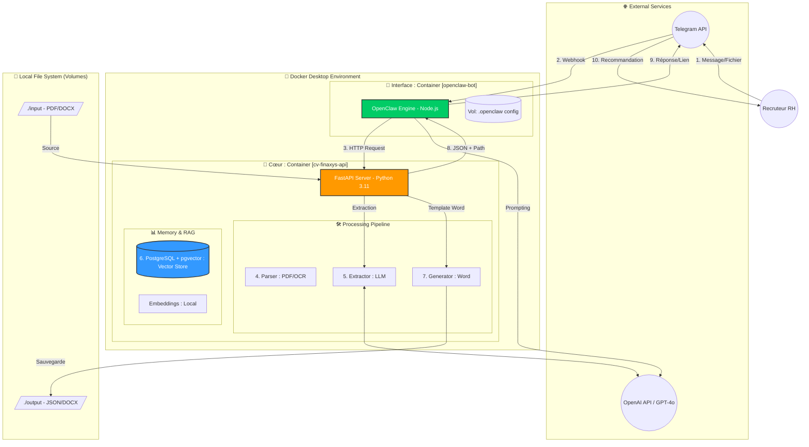

# 🏗️ Architecture Systèmes & Flux de Données - Finaxys CV Intelligence

Ce schéma représente l'infrastructure complète **100% conteneurisée** et la séquence logique des opérations.

## 📋 Séquence des Opérations (Flux numérotés)

1.  **[1-2] Envoi** : Le recruteur envoie un message ou un fichier sur Telegram. OpenClaw (Docker) le reçoit.
2.  **[3] Requête** : OpenClaw identifie le besoin (Recherche ou Analyse) et appelle l'API Finaxys.
3.  **[4] Parsing** : L'API extrait le texte du CV (utilise l'OCR si nécessaire).
4.  **[5] Extraction** : Le LLM transforme le texte en données structurées (Langues, Certifs, etc.).
5.  **[6] Indexation/Recherche** : 
    *   *Si Analyse* : Le CV est indexé dans PostgreSQL avec pgvector.
    *   *Si Recherche* : Le système cherche les meilleurs profils par proximité sémantique.
6.  **[7] Génération** : Le document Word officiel est créé à partir du template.
7.  **[8] Retour** : L'API renvoie le résultat JSON et le chemin du fichier Word à OpenClaw.
8.  **[9-10] Livraison** : OpenClaw rédige la réponse finale et l'envoie au recruteur sur Telegram.

---

## 🏗️ État de l'Infrastructure
*   **Conteneur `openclaw-bot`** : Isolé, gère la logique conversationnelle.
*   **Conteneur `cv-finaxys-api`** : Gère toute la logique métier et l'IA.
*   **Volumes** : Toutes les données (CV, Vecteurs, Config) sont persistées sur l'hôte.

*Astuce : Appuyez sur `Ctrl+Shift+V` dans VS Code pour voir le schéma interactif.*
