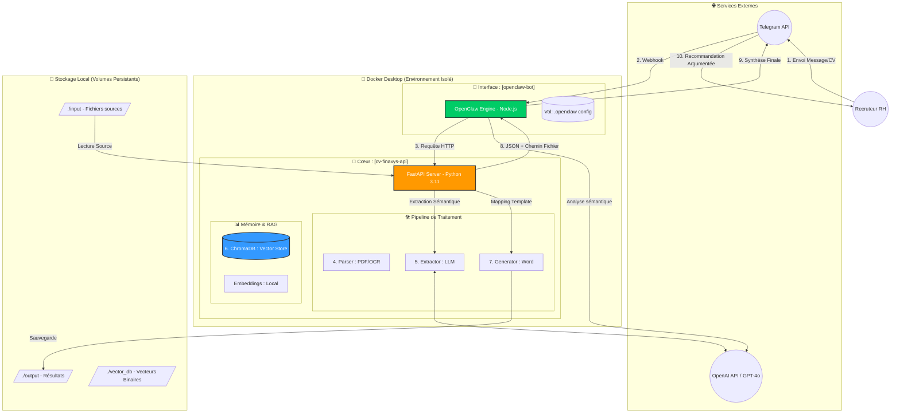

# 🚀 Master Project : Finaxys CV Intelligence & RAG

Ce document est le guide suprême de l'architecture, du fonctionnement et de la maintenance de l'écosystème.

---

## 1. 🏗️ Architecture Systèmes & Flux Numérotés (100% Docker)

Cette architecture sépare l'interface conversationnelle (Telegram) du moteur de traitement (Python/IA).



---

## 2. 📝 Séquence de Fonctionnement (Le Cheminement)

1.  **[1-2] Ingestion** : Le recruteur communique avec le bot Telegram.
2.  **[3] Orchestration** : OpenClaw (Docker) identifie l'intention et sollicite l'API locale.
3.  **[4] Parsing** : L'API extrait le texte (utilise **Tesseract OCR** si le PDF est une image).
4.  **[5] Extraction Sémantique** : GPT-4o transforme le texte en JSON (Focus : **Certifications** et **Barres de langues**).
5.  **[6] Indexation RAG** : Le CV est transformé en vecteurs et stocké dans **ChromaDB**.
6.  **[7] Génération DOCX** : Un document Word officiel est créé via le template `finaxys_template.docx`.
7.  **[8] Feedback API** : L'API renvoie les données et le chemin du fichier Word à OpenClaw.
8.  **[9-10] Recommandation** : Le bot rédige une réponse personnalisée ("Thomas Dubois est un bon profil car...") sur Telegram.

---

## 3. 🛠️ Technologies Clés

| Composant | Technologie | Rôle |
| :--- | :--- | :--- |
| **API** | FastAPI (Python) | Orchestration des services et endpoints. |
| **LLM** | OpenAI (GPT-4o) | Intelligence d'extraction et de synthèse. |
| **OCR** | Tesseract | Lecture des CV scannés. |
| **Vector DB** | ChromaDB | Mémoire sémantique du projet. |
| **Embeddings** | all-MiniLM-L6-v2 | Recherche sémantique locale et gratuite ($0). |
| **Bot** | OpenClaw | Agent conversationnel et interface Telegram. |

---

## 4. 🚀 Commandes Vitales

### Démarrage Rapide (Tout-en-un) :
```bash
docker-compose up -d --build
```

### Indexer un nouveau dossier de CV :
```bash
python main.py process-dir ./input --index --skip-word
```

### Faire une recherche RAG locale :
```bash
python search_rag.py "Cherche un dev PHP avec Scrum"
```

---

## 5. ⚠️ Notes de Maintenance
*   **Données Persistantes** : Ne supprimez pas le dossier `vector_db` ou le volume `.openclaw` si vous voulez garder votre base de CV et votre session Telegram.
*   **Coûts LLM** : Surveillez votre consommation sur OpenAI. L'utilisation de GPT-4o coûte environ **2 centimes par recherche**.
*   **Template Word** : Le modèle se trouve dans `templates/`. Modifiez-le pour changer le look du document final généré.

---