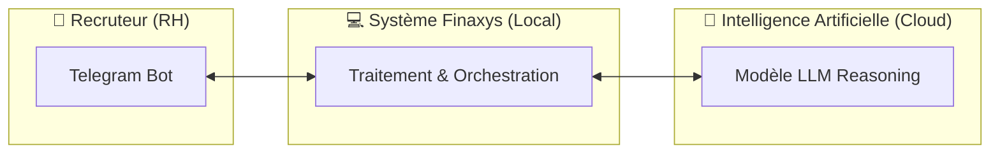

# Slide 1 : Vue Macro (Le Concept)

```mermaid
graph LR
    subgraph User ["👤 Recruteur (RH)"]
        A[Telegram Bot]
    end

    subgraph System ["💻 Système Finaxys (Local)"]
        B[Traitement & Orchestration]
    end

    subgraph Brain ["🧠 Intelligence Artificielle (Cloud)"]
        C[Modèle LLM Reasoning]
    end

    A <--> B
    B <--> C
```
