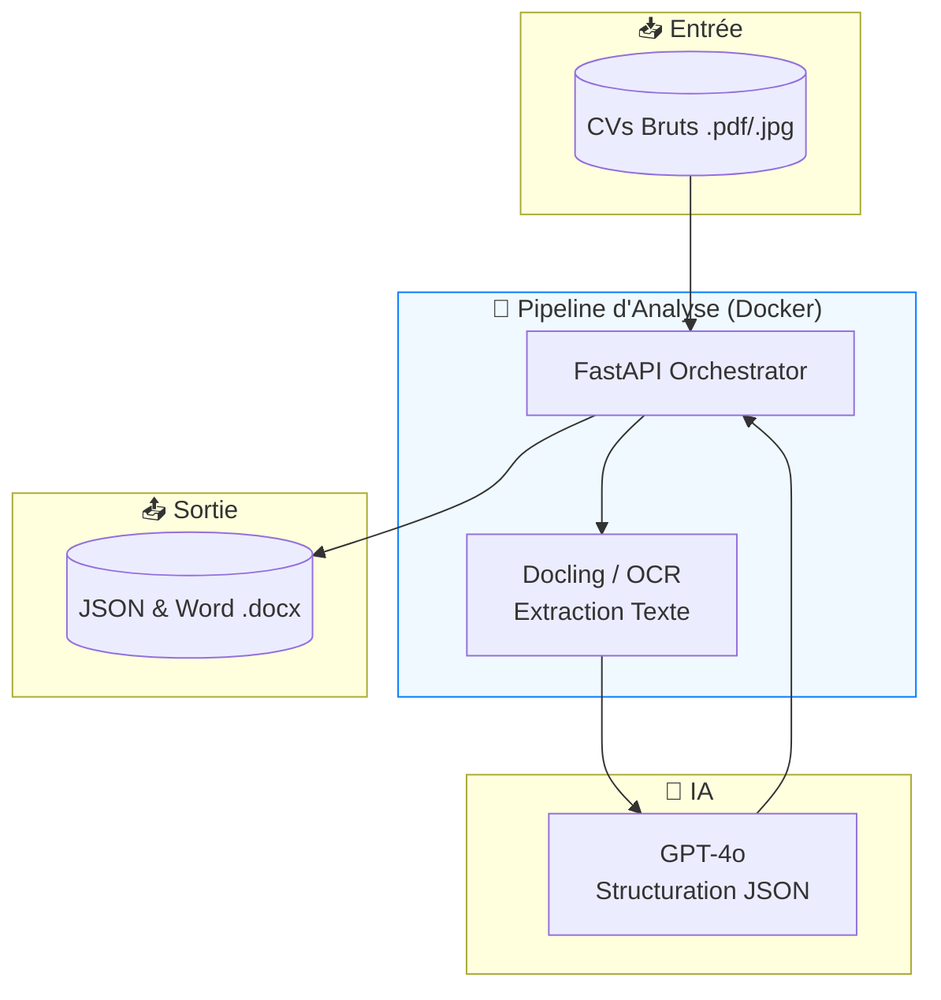

# Slide 2 : Focus sur l'Analyse & Structuration (Pipeline)

```mermaid
graph TD
    subgraph IN ["📥 Entrée"]
        I[(CVs Bruts .pdf/.jpg)]
    end

    subgraph PROC ["🐳 Pipeline d'Analyse (Docker)"]
        C[FastAPI Orchestrator]
        D[Docling / OCR<br/>Extraction Texte]
    end

    subgraph LLM ["🧠 IA"]
        F[GPT-4o<br/>Structuration JSON]
    end

    subgraph OUT ["📤 Sortie"]
        O[(JSON & Word .docx)]
    end

    I --> C
    C --> D
    D --> F
    F --> C
    C --> O

    style PROC fill:#f0f9ff,stroke:#007bff
```
