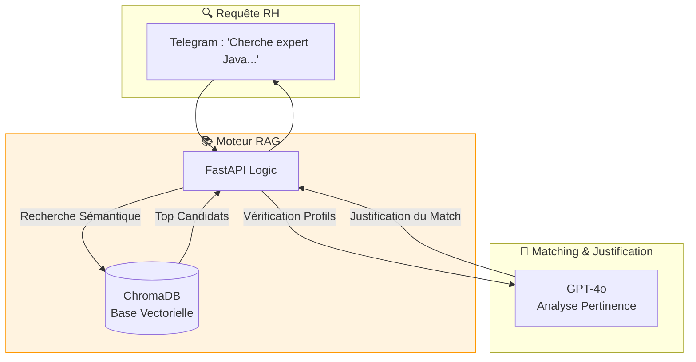

# Slide 3 : Focus sur le RAG (Recherche Intelligente)

```mermaid
graph TD
    subgraph QUERY ["🔍 Requête RH"]
        A[Telegram : 'Cherche expert Java...']
    end

    subgraph RAG ["📚 Moteur RAG"]
        E[(ChromaDB<br/>Base Vectorielle)]
        C[FastAPI Logic]
    end

    subgraph REASON ["🧠 Matching & Justification"]
        F[GPT-4o<br/>Analyse Pertinence]
    end

    A --> C
    C -- "Recherche Sémantique" --> E
    E -- "Top Candidats" --> C
    C -- "Vérification Profils" --> F
    F -- "Justification du Match" --> C
    C --> A

    style RAG fill:#fff3e0,stroke:#ff9800
```
