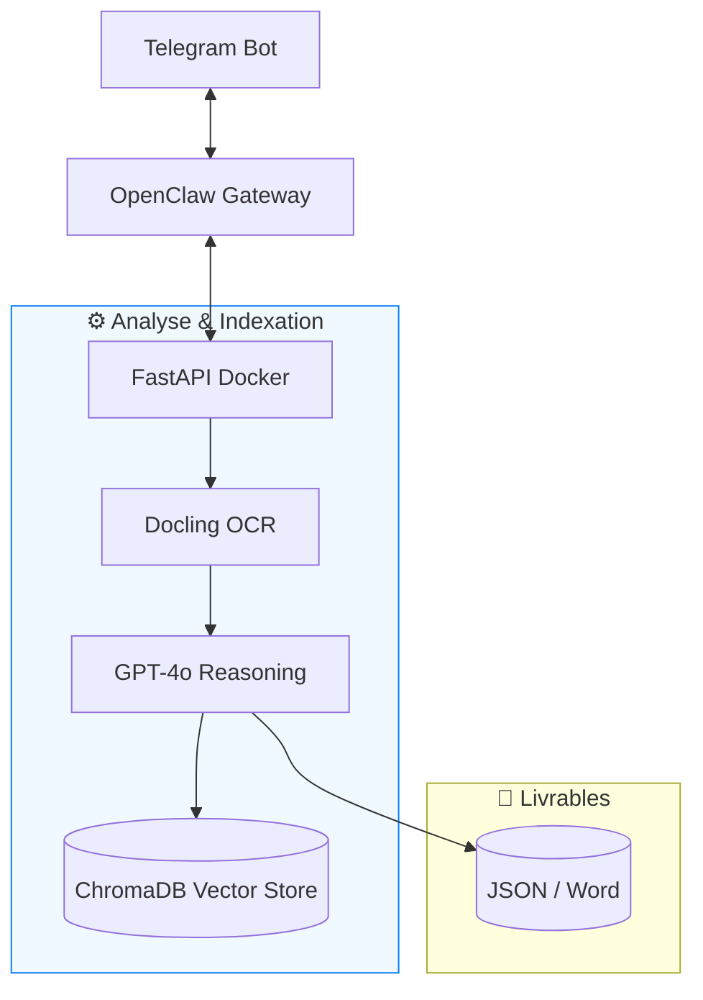

# Slide 4 : Architecture Complète (Synthèse)

```mermaid
graph TD
    A[Telegram Bot] <--> B[OpenClaw Gateway]
    B <--> C[FastAPI Docker]
    
    subgraph ANALYSE ["⚙️ Analyse & Indexation"]
        C --> D[Docling OCR]
        D --> F[GPT-4o Reasoning]
        F --> E[(ChromaDB Vector Store)]
    end

    subgraph OUTPUT ["📄 Livrables"]
        F --> O[(JSON / Word)]
    end

    style ANALYSE fill:#f0f9ff,stroke:#007bff
```
